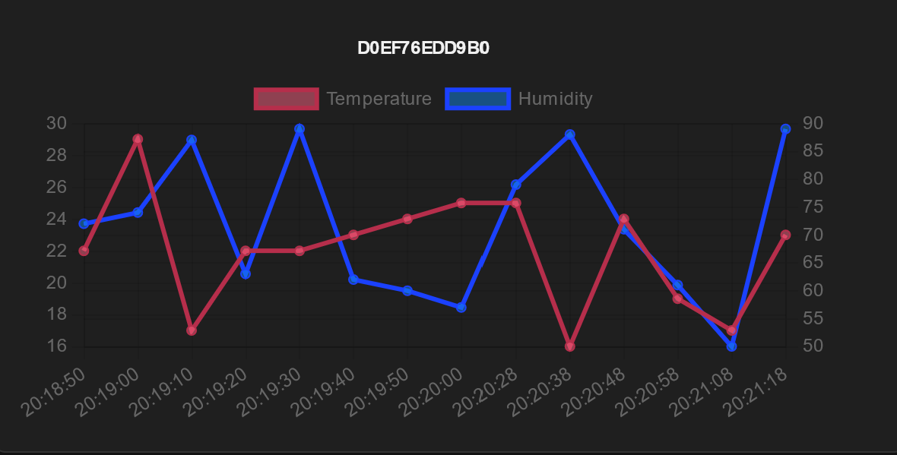
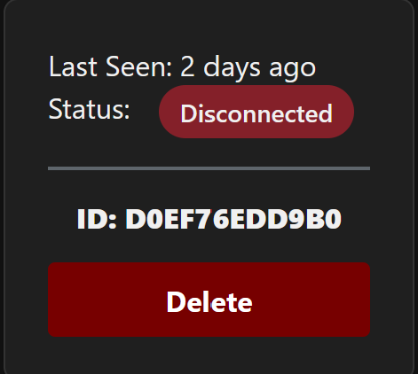
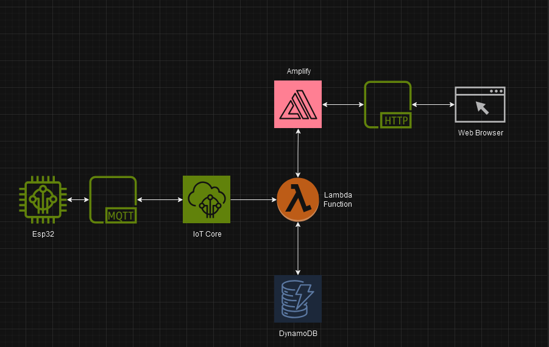

# IoT Temperature Monitoring with AWS IoT Core, Amplify, and ESP32

## Table of Contents
- [Overview](#overview)
- [Features](#features)
- [Architecture](#architecture)
- [Getting Started](#getting-started)
  - [Hardware Requirements](#hardware-requirements)
  - [Software Requirements](#software-requirements)
  - [AWS Services](#aws-services)
- [Setup Instructions](#setup-instructions)
  - [ESP32 Configuration](#esp32-configuration)
  - [AWS Configuration](#aws-configuration)
  - [React Frontend](#react-frontend)
  - [Graphs](#graphs)
- [License](#license)

---

## Overview

This project demonstrates a secure and scalable IoT solution for real-time temperature and humidity monitoring. The system uses an ESP32 microcontroller with a DHT sensor to collect data, which is then transmitted to AWS IoT Core via MQTT. The data is visualized in a web frontend built with AWS Amplify and React.

---

## Features

- Real-time data collection from ESP32 using a DHT11 sensor.
- Secure communication with AWS IoT Core using MQTT over TLS.
- Data storage in AWS DynamoDB for scalability.
- Interactive data visualization using React and Chart.js.
- Device management and telemetry viewing in the frontend.

---

## Architecture


The system consists of:
1. **ESP32**: Collects temperature and humidity data and publishes it to AWS IoT Core.
2. **AWS IoT Core**: Acts as a gateway to securely ingest data.
3. **AWS DynamoDB**: Stores telemetry data for retrieval and analysis.
4. **React Frontend**: Built using AWS Amplify, it visualizes the data and provides device management capabilities.

---

## Getting Started

### Hardware Requirements
- ESP32 microcontroller.
- DHT11 sensor (or DHT22 for higher precision).
- Breadboard and connecting wires.

### Software Requirements
- Arduino IDE with PlatformIO or equivalent for ESP32 programming.
- Node.js (for frontend development).
- AWS CLI installed and configured.

### AWS Services
The project uses the following AWS services:
- AWS IoT Core
- AWS DynamoDB
- AWS Amplify
- AWS Lambda (optional for advanced data processing)

---

## Setup Instructions

### ESP32 Configuration
1. **Setup PlatformIO**:
   - Install [PlatformIO](https://platformio.org/) in your IDE (e.g., VSCode).
   - Configure the ESP32 environment with the necessary libraries:
     - `WiFi.h` for Wi-Fi connectivity.
     - `MQTTClient.h` for MQTT communication.
     - `ArduinoJson.h` for JSON parsing.

2. **Configure `secrets.h`**:
   Create a `secrets.h` file with your Wi-Fi and AWS IoT credentials:
   ```c
   #define WIFI_SSID "YourWiFiSSID"
   #define WIFI_PASSWORD "YourWiFiPassword"
   #define AWS_IOT_ENDPOINT "your-iot-endpoint.amazonaws.com"
   #define AWS_CERT_CA "path/to/root-CA.pem"
   #define AWS_CERT_CRT "path/to/certificate.pem.crt"
   #define AWS_CERT_PRIVATE "path/to/private.pem.key"
``

   ### AWS Configuration

1. **AWS IoT Core**:
   - Create a new IoT thing in the AWS Management Console.
   - Download the device certificates and root CA.
   - Attach an IoT policy with permissions for publishing and subscribing to MQTT topics.

2. **DynamoDB**:
   - Create a table named `Telemetry` with the following schema:
     - `device_id` (Primary Key)
     - `timestamp` (Sort Key)
     - Additional attributes: `temperature`, `humidity`.
    
3. **AWS Amplify**
  -Initialize a new Amplify project in your React frontend:
   ```bash
   amplify init
   amplify add api
   amplify push
   ```
   - Connect the API to your DynamoDB table
   
   ### React Frontend
1. **Install Dependencies**
   ```bash
   npm i
   npm start
   ```
   **Frontend Repository**
   [Here's A Link To The Frontend Repo](https://github.com/Rohnson95/aws-amplify-frontend)
   ### Images
  
  
  ### Flowchart
  ![Flowchart]
  